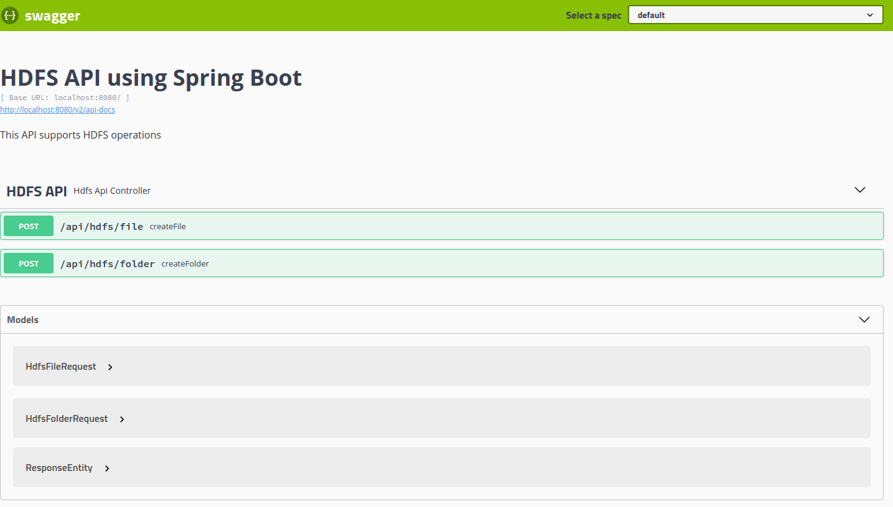

# HDFS API using SpringBoot

[HDFS](https://hadoop.apache.org/docs/r1.2.1/hdfs_design.html) allows you to interact with it in different ways. One of them is providing an API for Java.

##### Requeriments

- Hadoop/HDFS (Cloudera QuickStart VM: https://www.cloudera.com/downloads/quickstart_vms/5-13.html)
- JDK 7+

## The problem

It needs an agile way to interact with HDFS without knowledge about HDFS terminal commands and Cloudera tools.

## The solution

In addition to the command line, Hadoop also provides a Java API. A Spring Boot project can be developed to have an easy-to-use API that allows you to interact with the HDFS.

##### HDFS API dependency

To use these tools, you just have to add the dependency in the _pom.xml_ file.

```xml
<dependency>
    <groupId>org.apache.hadoop</groupId>
    <artifactId>hadoop-client</artifactId>
    <version>2.6.0</version>
</dependency>
```

##### HDFS API configuration

To configure the connection, you simply have to define the HDFS server and its user in the application.yml file (or application.properties)

```yaml
hdfs:
  configuration:
    server: hdfs://localhost:8020/
    user: hdfs
```

With the data defined above, a Spring configuration bean is created with the HDFS configuration

```java
@Configuration
public class HdfsConfiguration{
  
  @Value("${hdfs.configuration.server}") String hdfsServer;
  @Value("${hdfs.configuration.user}") String hdfsUser;
  
  @Bean
  public org.apache.hadoop.conf.Configuration config(){
    System.setProperty("HADOOP_USER_NAME", hdfsUser);
    org.apache.hadoop.conf.Configuration config = new org.apache.hadoop.conf.Configuration(true);
    config.set("fs.defaultFS", hdfsServer);
    return config;
  }
  
}
```

##### HDFS API use

To use the configuration, the Spring configuration bean is injected into the service that interacts with HDFS

```java
private HdfsConfiguration hdfsConfiguration;
  
@Autowired
public HdfsApiService(HdfsConfiguration hdfsConfiguration){
  this.hdfsConfiguration = hdfsConfiguration;
}
```

This configuration is used to create an object of the [FileSystem](https://hadoop.apache.org/docs/stable/api/org/apache/hadoop/fs/FileSystem.html) class, which interacts with HDFS through the API provided by Hadoop.

```java
public void createFolder(String folderName) throws IOException{
  
    FileSystem hdfsFS = FileSystem.get(hdfsConfiguration.config());
    Path folderPath = new Path(hdfsFS.getHomeDirectory().toString() + "/" + folderName);
  
    ...
    
    hdfsFS.mkdirs(folderPath); // creating folder in HDFS
    hdfsFS.close();
    
}
```

## The case of use

Finally, to verify its operation, there is Swagger where the API is documented and allows interacts with HDFS.




